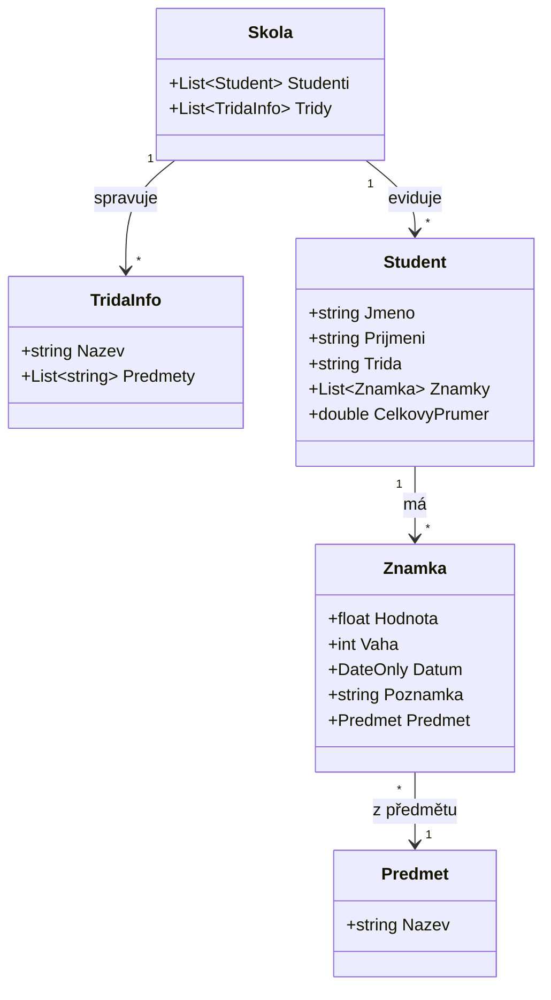

# Bakaláři – Evidence studentů

Desktopová aplikace pro správu studentů a jejich klasifikace. Umožňuje vést přehled tříd, předmětů a hodnocení, počítat vážené průměry a exportovat výsledky. Napsána v C# (.NET 9) s frameworkem [Avalonia UI](https://avaloniaui.net/) – běží na Windows.

## Funkce

- Správa tříd a jejich předmětů
- Přidávání studentů ručně nebo hromadným importem ze souboru `.txt`
- Zadávání známek s hodnotou, váhou, datem a poznámkou (téma zkoušení)
- Vážený průměr za každý předmět i celkově, upozornění při ohroženém prospěchu
- Filtrování a vyhledávání studentů v hlavním okně
- Export klasifikace do CSV, záloha a obnova dat ve formátu JSON
- Podpora světlého i tmavého motivu (sleduje nastavení systému)

## Datový model



## Sestavení a spuštění

Vyžaduje [.NET 9 SDK](https://dotnet.microsoft.com/download).

```bash
dotnet run --project Bakalari/Bakalari.csproj
```

Vydání pro Windows (samostatný `.exe` bez nutnosti instalace .NET) se sestavuje automaticky při každém pushnutí do větve `main` přes GitHub Actions a je dostupné v záložce **Releases**.
